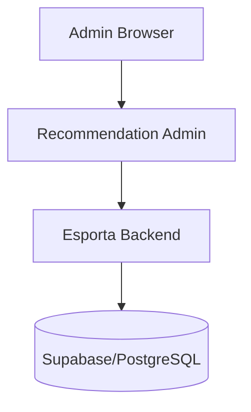

# Recommendation Admin Architecture

## Overview
The architecture is strictly separated between the administration UI and the actual recommendation system.

## Security & Constraints
- The **Frontend** never accesses the database directly.
- The **Frontend** does not compute or define recommendations.
- All configuration schema bounds are defined on the backend and respected/replicated on the frontend.
- Authentication/Authorization relies entirely on the Esporta Backend.
- No direct Supabase PostgREST access.

## Modules

### Dashboard / Overview
Calls `/api/v1/admin/recommendations/overview` to get high-level metrics and system health.

### Configuration
Uses `/api/v1/admin/recommendations/config/*` to read drafts, create versions, validate, and activate configurations.

### Analytics
Queries `/api/v1/admin/recommendations/analytics/*` for telemetry about Feed, Shorts, and Search performance.

### Debugger
Hits `/api/v1/admin/recommendations/debug/*` (user, content, identity, ranking). The backend generates traces and human-readable explanations based on the executed ranking algorithm.

### Interventions
Manages operational overrides through `/api/v1/admin/recommendations/interventions`.

### Audit
Pulls logs of all mutations from `/api/v1/admin/recommendations/audit`.
Phase 2 Recommendation Admin completed and verified with all routes active.
